# Open Haneum (오픈 한음)

오픈 한음은 노래 가사를 분석해서 외국어 공부에 필수적인 번역, 한글 발음, 단어, 문법을 자동으로 정리해주는 웹 애플리케이션입니다. AI(LLM)를 활용하여 가사의 번역과 발음 표기를 제공하며, 특히 일본어/중국어 가사의 경우 한자 정보도 함께 제공합니다.
(단, 현재의 LLM 기술로는, 20% 가량 틀린 정보가 생성되는 관계로 신뢰할 수 있는 콘텐츠를 만들기 위해서는 사람이 직접 검토 후 수정할 필요가 있습니다.)


## 주요 기능

- **가사 번역**: AI를 활용한 신속한 가사 번역
- **발음 표기**: 외래어 표기법에 따른 발음 표기
- **문법 분석**: 문장 구조 분석 및 설명
- **한자 정보**: 일본어/중국어 가사의 경우 한자 정보 제공
- **번역 관리**: 가사 추가, 수정, 삭제 기능
- **검색 기능**: 원제목, 한국어 제목, 아티스트명 검색 가능

## 사용 예시

### 일본어 가사 분석
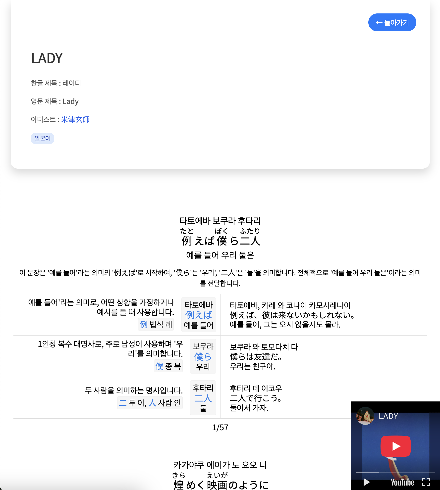

### 영어 가사 분석
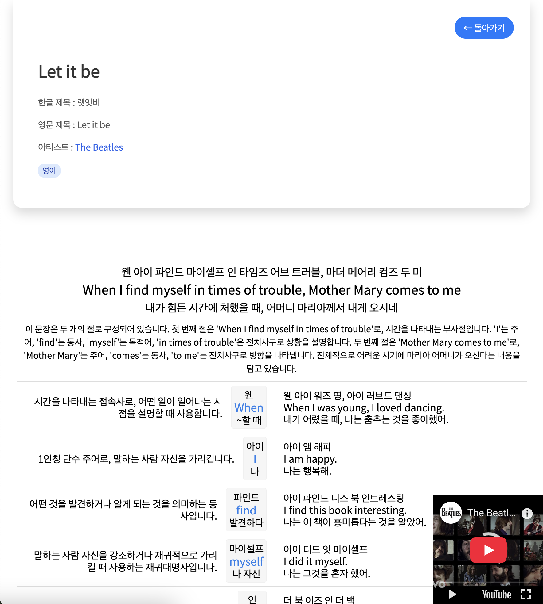

### 중국어 가사 분석
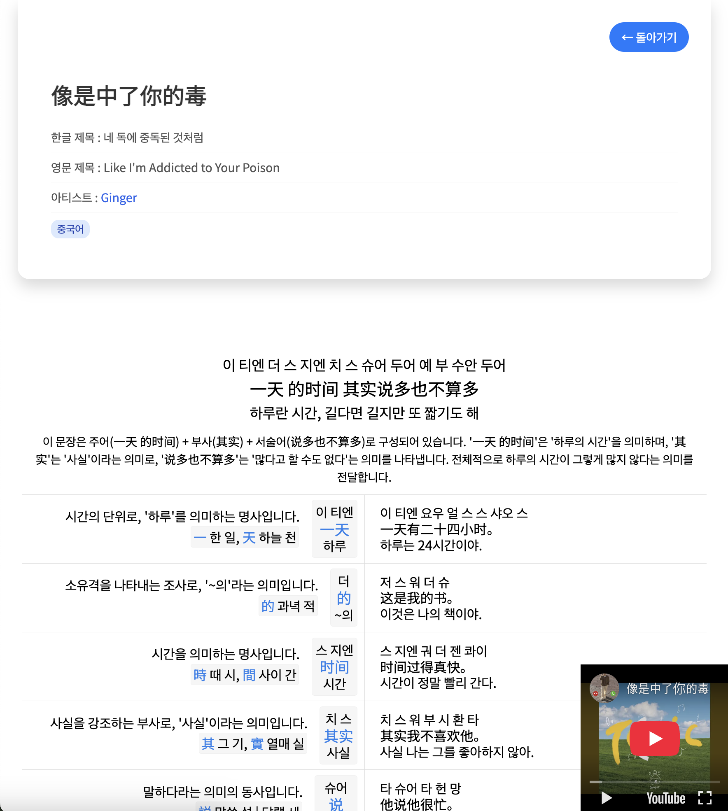

### 러시아어 가사 분석
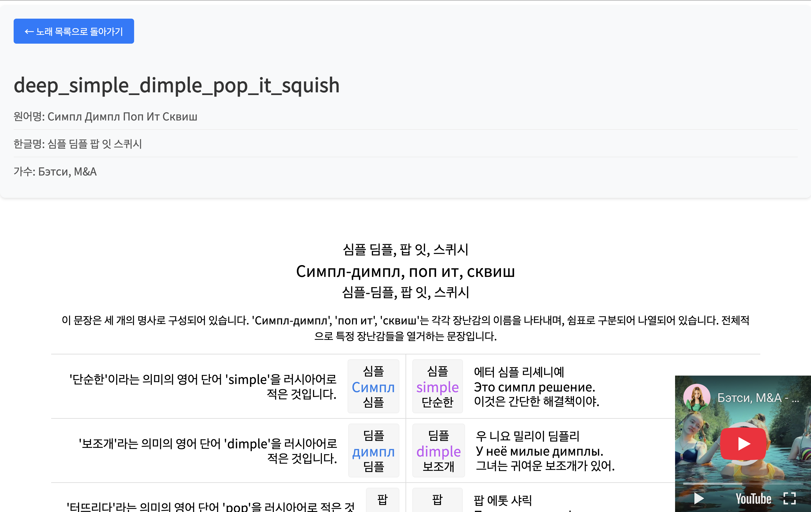

### 프랑스어 가사 분석
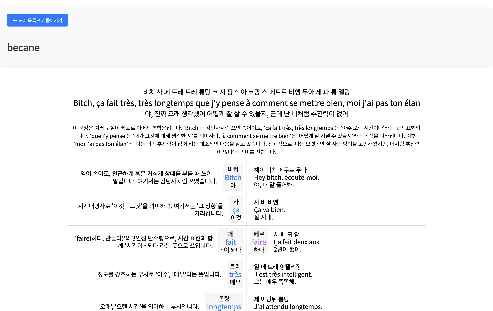

### 독일어 가사 분석
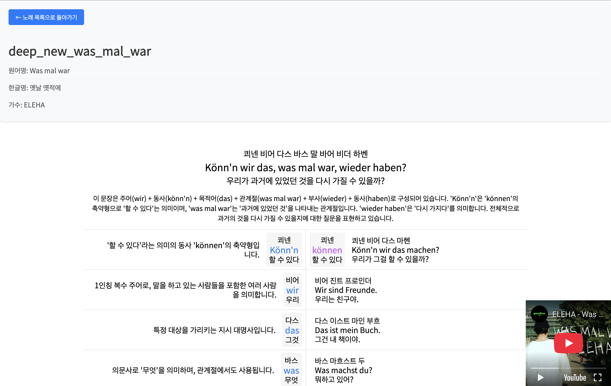

## 기술 스택

- **Backend**: Node.js, Express.js
- **Frontend**: EJS (Embedded JavaScript)
- **AI**: DeepSeek(OpenRouter를 통해 이용하는 것을 추천합니다.), Google Gemini API
- **데이터 저장**: JSON 파일 기반
- **기타**: CORS, Body-parser, Cheerio

## 설치 방법

1. 저장소 클론
```bash
git clone https://github.com/laespero/open-haneum.git
cd open-haneum
```

2. 의존성 설치
```bash
npm install
```

3. 환경 변수 설정
`.env` 파일을 생성하고 다음 내용을 추가: 
(OpenRouter에서 api_key를 발급 받아서 입력해주세요.)
```
OPENROUTER_API_KEY=your_open_router_api_key
```

4. 서버 실행

**개발 환경:**

개발 중에는 코드가 변경될 때마다 서버를 자동으로 재시작해주는 `nodemon`을 사용하는 것이 편리합니다.

```bash
npm run dev
```
위 명령은 `nodemon server.js`를 실행합니다.

**프로덕션 환경:**
애플리케이션 시작:
```bash
npm start
```
위 명령은 `node server.js` 명령을 실행합니다.

서버가 시작되면 웹 브라우저에서 `http://localhost:3000`로 접속하여 확인할 수 있습니다.

## 사용 방법

1. 메인 페이지에서 "노래 추가하기" 버튼을 클릭하여 새 노래를 추가합니다.
2. 노래 제목, 아티스트명, 유튜브 링크, 노래 가사를 입력 후 저장합니다. (일본어 노래 가사의 경우 일본어만 입력해 주세요. 독음/번역은 알아서 만들어집니다.)
3. 번역 관리 페이지에서 "번역하기" 버튼을 클릭하여 AI 번역을 시작합니다. (페이지를 닫아도 정상적으로 처리되기 때문에, 오래 걸린다면 3분 뒤에 다시 사이트에 방문해 보세요.)
4. 번역이 완료되면 노래 가사의 번역, 발음, 문법 분석 결과를 확인할 수 있습니다.
5. 필요한 경우 번역을 수정하거나 발음을 정정할 수 있습니다.

### 노래 추가 방법
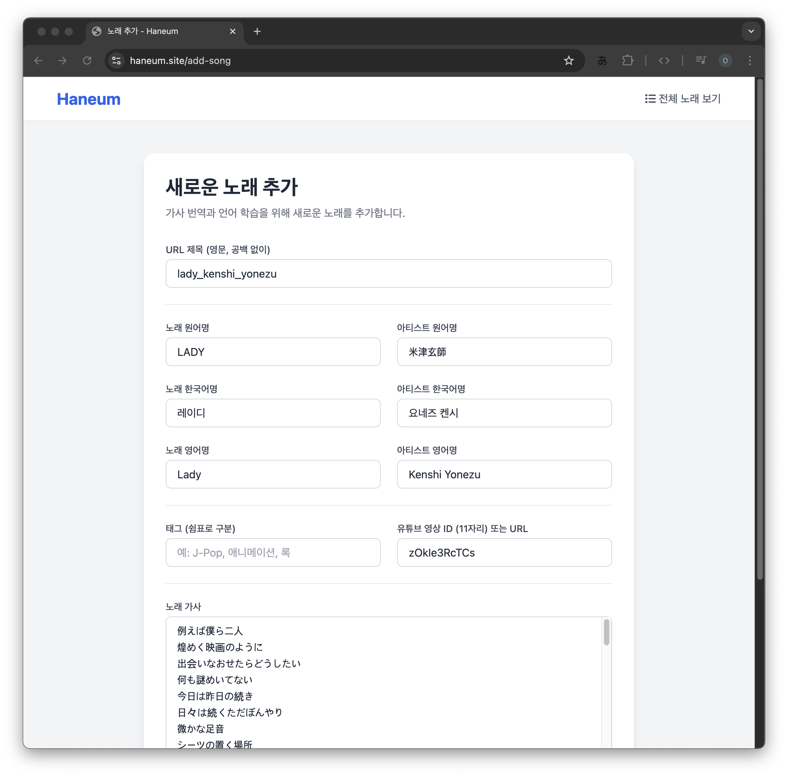

### 번역 관리 페이지
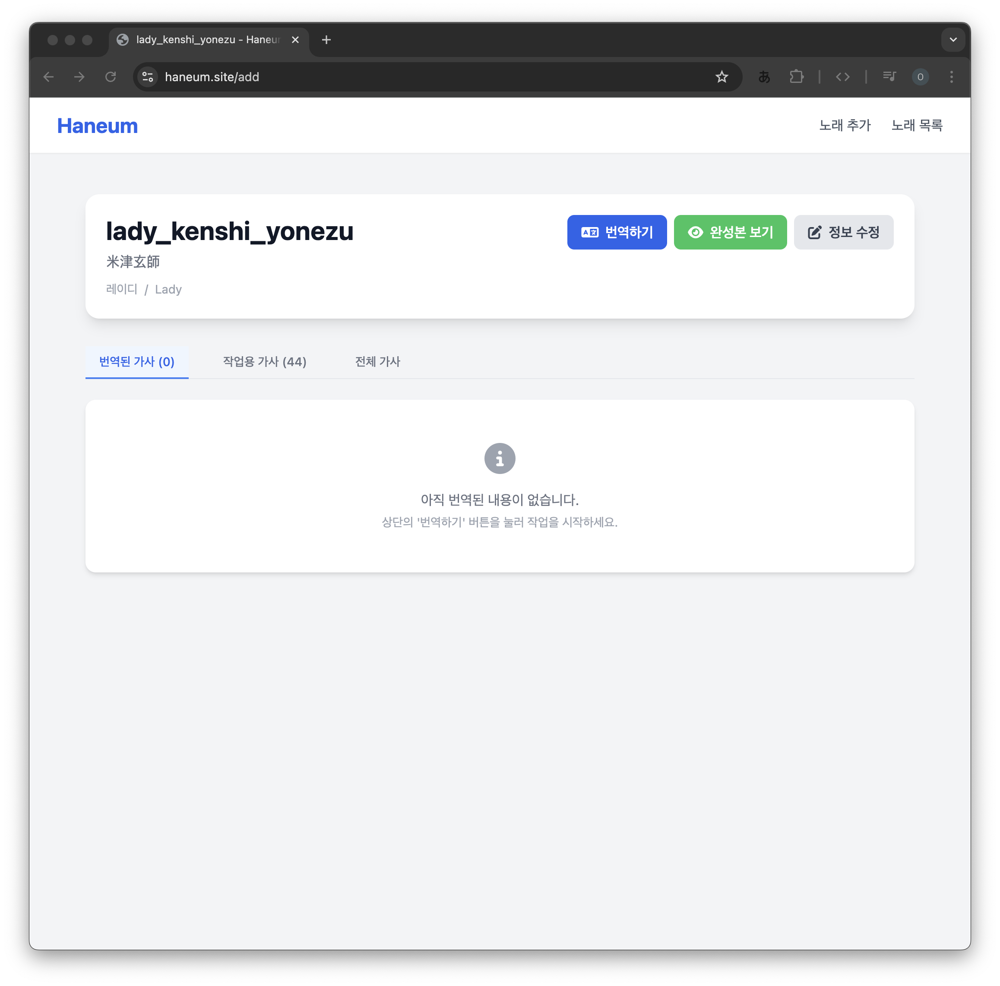

### 번역 완료 시
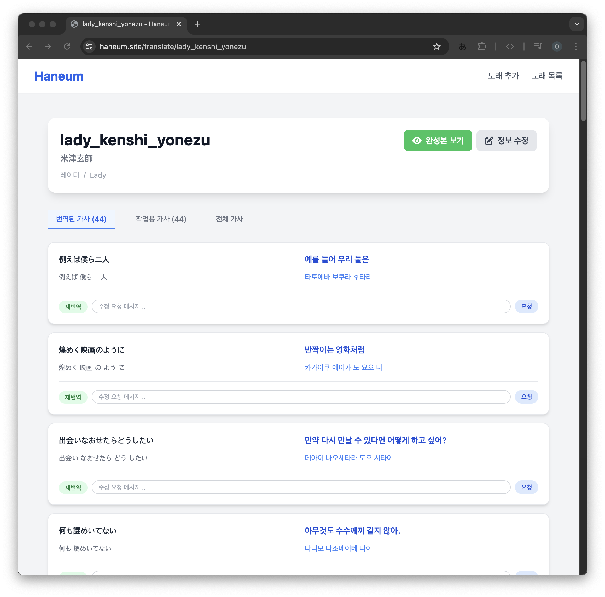

### 노래 정보 수정
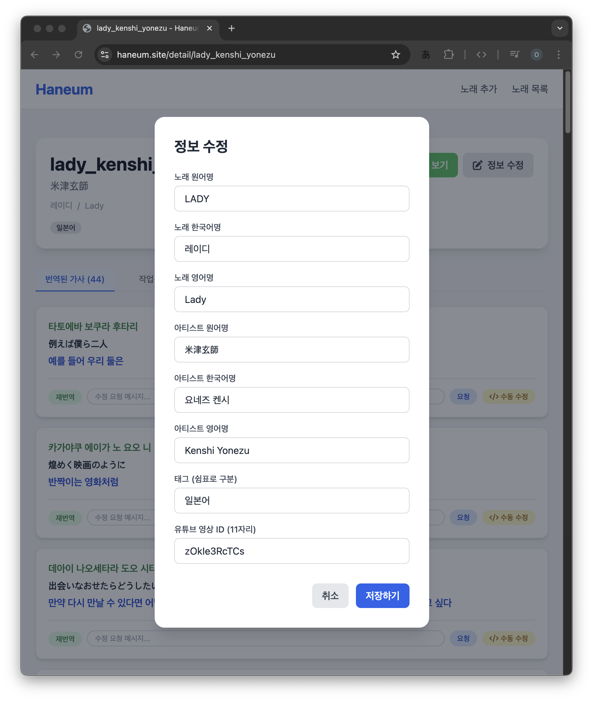

### 가사 데이터 수정
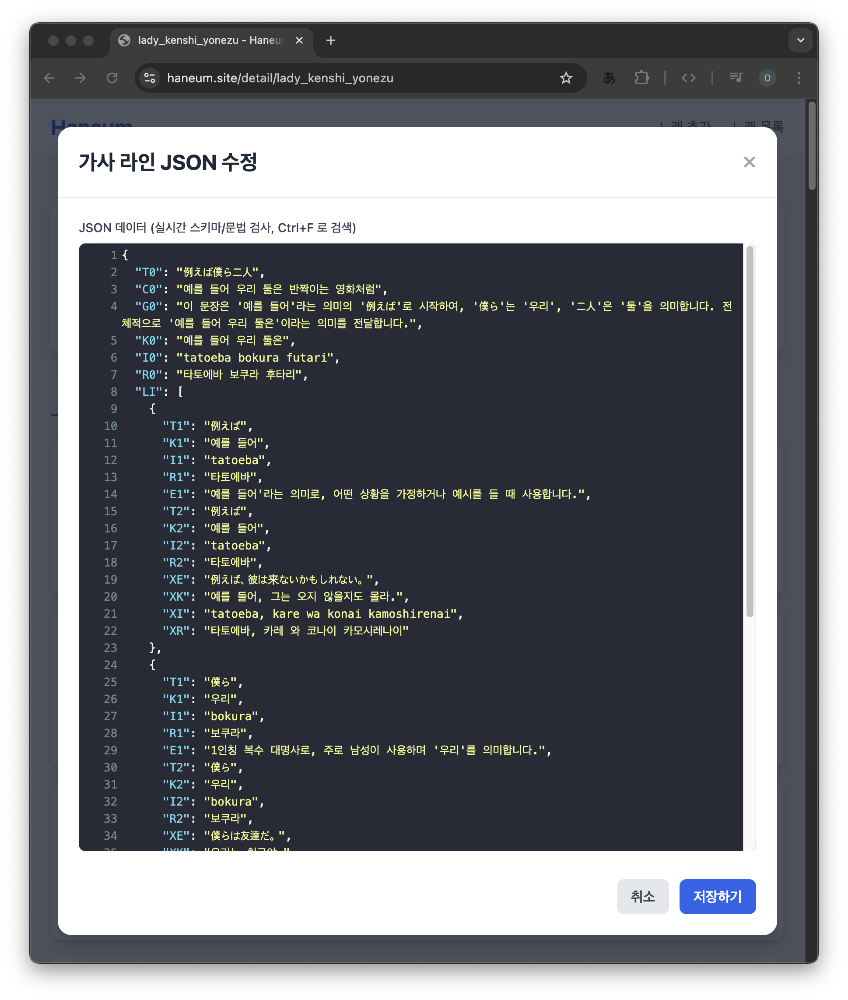
- 번역된 각 라인 옆의 '직접 수정' 버튼을 통해 개별 가사 데이터(번역, 발음, 단어 정보 등)를 직접 수정할 수 있습니다.


### 가사 보기 페이지
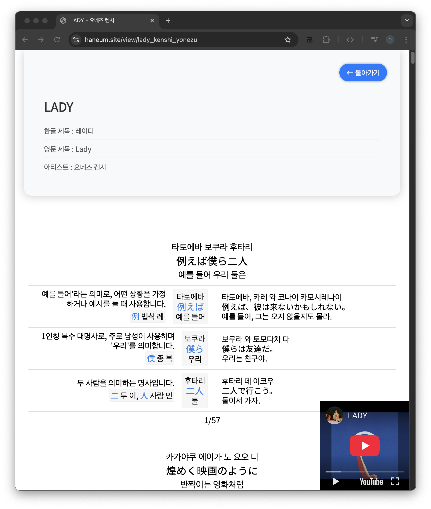


## 단축키

가사 보기 페이지(`songView.ejs`)에서 사용할 수 있는 단축키입니다:

### 모드 전환
- `0`: 스크롤 모드와 슬라이드 모드 전환

### 표시 옵션
- `1`: IPA 발음 표시 토글
- `2`: 문법 설명 표시/숨김 토글
- `3`: 간단 보기 모드 토글
- `4`: 단순 보기 모드 토글
- `5`: 블로그 모드 토글

### 슬라이드 제어
- `A` 또는 `J`: 이전 슬라이드
- `D` 또는 `L`: 다음 슬라이드
- `S` 또는 `K`: 재생/일시정지


## 프로젝트 구조

```
open-haneum/
├── public/           # 정적 파일
│   ├── css/         # 스타일시트
│   ├── hanja.js     # 한자 데이터
│   └── youtube.js   # 유튜브 관련 스크립트
├── songs/           # 가사 데이터 저장소
├── views/           # EJS 템플릿
│   ├── addSong.ejs  # 가사 추가 페이지
│   ├── edit.ejs     # 가사 수정 페이지
│   ├── landing.ejs  # 메인 페이지
│   ├── lyrics.ejs   # 가사 보기 페이지
│   ├── search.ejs   # 검색 결과 페이지
│   ├── songDetail.ejs # 가사 상세 페이지
│   └── songView.ejs  # 가사 보기 페이지
├── messages.js      # LLM 프롬프트, deepseek 모델에 최적화된 프롬프트입니다.
├── jp_messages.js   # LLM 프롬프트, 일본어 화자를 위한 프롬프트입니다.
├── server.js        # 메인 서버 파일
└── package.json     # 프로젝트 설정
```

## API 엔드포인트

### 번역 관리
- `GET /`: 메인 페이지
- `GET /add-song`: 가사 추가 페이지
- `POST /add`: 새 가사 추가
- `GET /edit/:title`: 가사 수정 페이지
- `POST /update`: 가사 업데이트

### 가사 보기
- `GET /songs`: 가사 목록
- `GET /songs/:title`: 특정 가사 보기
- `GET /view/:title`: 가사 상세 보기
- `GET /detail/:title`: 가사 상세 정보

### 번역 관련
- `POST /translate/:title`: 가사 번역
- `POST /retry-translation/:title`: 번역 재시도
- `POST /retry-line/:title`: 특정 라인 재번역
- `POST /update-line/:title`: 특정 라인 JSON 수동 업데이트

### API
- `GET /api/songs/:title/translated`: 번역된 가사 조회
- `GET /api/search`: 가사 검색

## 라이선스

이 프로젝트는 MIT 라이선스 하에 배포됩니다. 자세한 내용은 [LICENSE](LICENSE) 파일을 참조하세요.

## 연락처
- 프로젝트 관리자: rnnwkals1@naver.com
- 해당 프로젝트에 기여하고 싶으신 경우 연락 주시면, 제가 아는 선에서 성심껏 답변드리겠습니다.