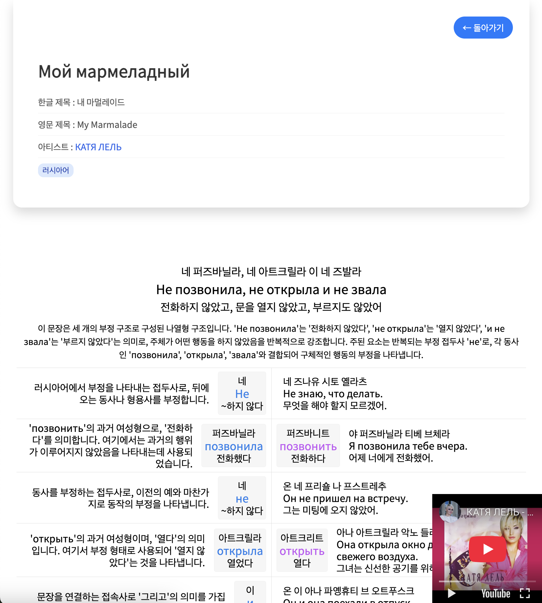
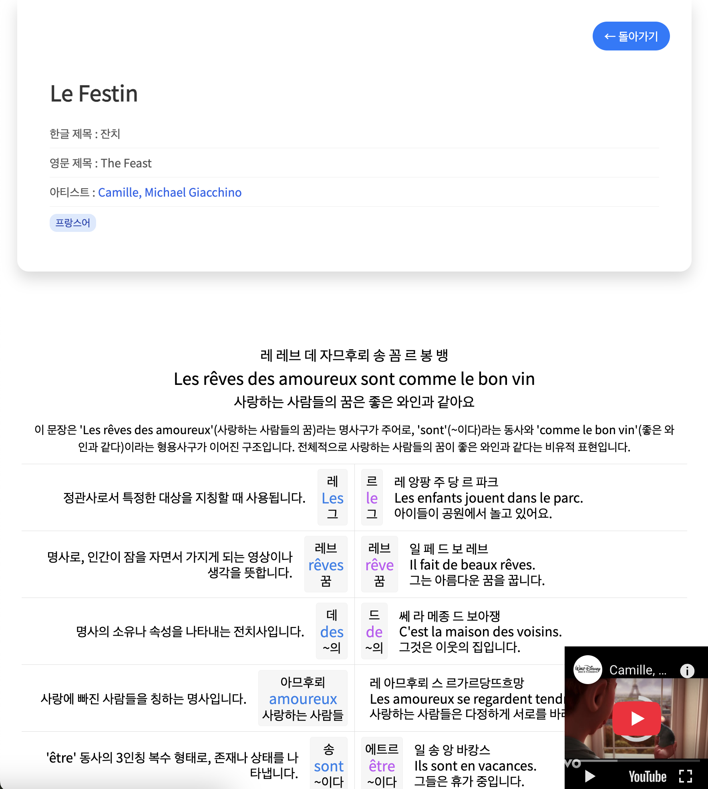
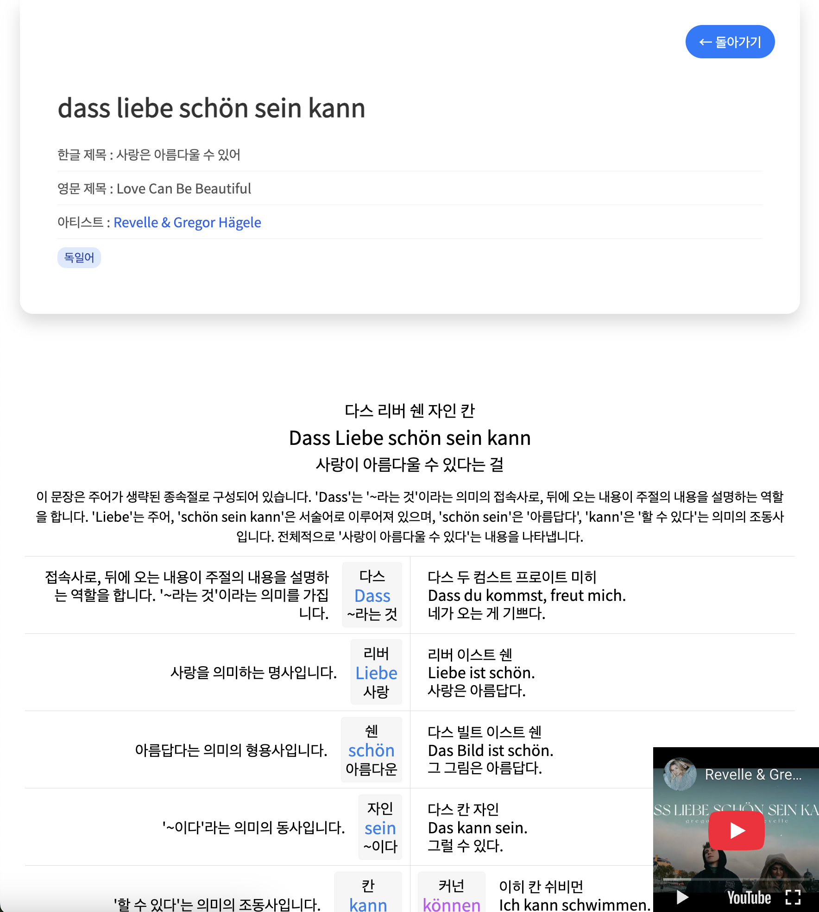
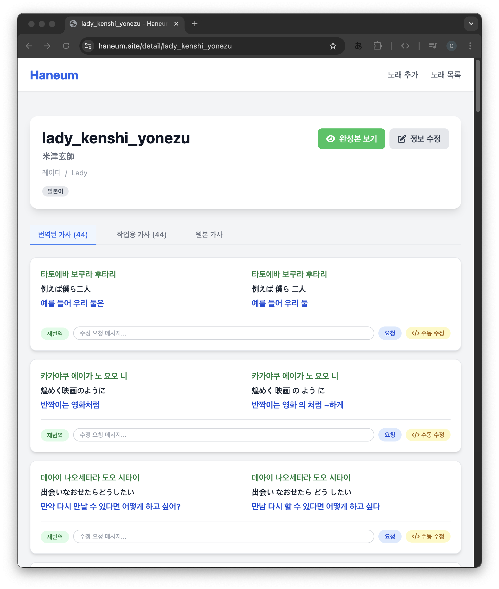

# Open Haneum (오픈 한음)

오픈 한음은 노래 가사를 분석해서 외국어 공부에 필수적인 번역, 한글 발음, 단어, 문법을 자동으로 정리해주는 웹 애플리케이션입니다. AI(LLM)를 활용하여 가사의 번역과 발음 표기를 제공하며, 특히 일본어/중국어 가사의 경우 한자 정보도 함께 제공합니다.

https://haneum.site/ 에서 지금 바로 기능을 체험해보세요!


## 주요 기능

- **가사 번역**: AI를 활용한 신속한 가사 번역
- **발음 표기**: 외래어 표기법에 따른 발음 표기
- **문법 분석**: 문장 구조 분석 및 설명
- **한자 정보**: 일본어/중국어 가사의 경우 한자 정보 제공
- **번역 관리**: 가사 추가, 수정, 삭제 기능
- **검색 기능**: 원제목, 한국어 제목, 아티스트명 검색 가능

## 사용 예시

### 일본어 가사 분석


### 영어 가사 분석


### 중국어 가사 분석


### 러시아어 가사 분석


### 프랑스어 가사 분석


### 독일어 가사 분석


## 사용 방법

1. 메인 페이지에서 "노래 추가하기" 버튼을 클릭하여 새 노래를 추가합니다.
2. 노래 제목, 아티스트명, 유튜브 링크, 노래 가사를 입력 후 저장합니다. (일본어 노래 가사의 경우 일본어만 입력해 주세요. 독음/번역은 알아서 만들어집니다.)
3. 번역 관리 페이지에서 "번역하기" 버튼을 클릭하여 AI 번역을 시작합니다. (페이지를 닫아도 정상적으로 처리되기 때문에, 오래 걸린다면 3분 뒤에 다시 사이트에 방문해 보세요.)
4. 번역이 완료되면 노래 가사의 번역, 발음, 문법 분석 결과를 확인할 수 있습니다.
5. 필요한 경우 번역을 수정하거나 발음을 정정할 수 있습니다.

### 노래 추가 방법


### 번역 관리 페이지


### 번역 완료 시


### 노래 정보 수정


### 가사 데이터 수정

- 번역된 각 라인 옆의 '직접 수정' 버튼을 통해 개별 가사 데이터(번역, 발음, 단어 정보 등)를 직접 수정할 수 있습니다.

### 분석 결과 보기 페이지


### 인기 노래 (Popular Songs)
가장 많이 조회된 노래들의 순위를 확인할 수 있는 페이지입니다. 조회수 기반으로 정렬된 목록을 제공합니다.


### 인기 아티스트 (Popular Artists)
가장 많은 관심을 받은 아티스트들의 순위를 확인할 수 있는 페이지입니다. 아티스트별로 보유한 노래 수와 총 조회수를 기반으로 집계됩니다.


### 번역 수정하기

번역된 가사에 어색한 부분이 있다면, 상세 페이지에서 직접 수정할 수 있습니다. 수정 방법은 크게 두 가지입니다.

#### 1. AI를 이용한 자동 수정 (재번역 / 수정 요청)

AI에게 특정 지시를 내려 번역을 수정하게 하는 방법입니다.

*   **수정 요청**: 수정하고 싶은 가사 라인 아래의 입력창에 "이 부분은 ~~로 번역해줘" 또는 "이 단어의 발음은 '...'이 맞아" 와 같이 수정하고 싶은 내용을 자연스러운 한국어로 입력하고 '요청' 버튼을 누릅니다.
*   **재번역**: 특별한 지시 없이 AI가 제안하는 다른 번역을 보고 싶다면 '재번역' 버튼을 클릭하면 됩니다.


#### 2. 수동 수정 (JSON 데이터 직접 편집)

데이터를 직접 편집하여 원하는 내용으로 정확하게 수정하는 방법입니다.

*   **직접 수정**: '직접 수정' 버튼을 클릭하면 해당 라인의 모든 데이터(번역, 발음, 단어, 문법 설명 등)가 담긴 JSON 편집창이 열립니다.
*   **저장**: 내용을 수정한 뒤 '저장하기' 버튼을 누르면 즉시 반영됩니다.
*   **축약어 정리**: T로 시작하는 것은 원문/원단어, K로 시작하는 것은 "한국어 번역", R로 시작하는 것은 "한글 발음"입니다. 


## 단축키

가사 보기 페이지(`songView.ejs`)에서 사용할 수 있는 단축키입니다:

### 모드 전환
- `0`: 스크롤 모드와 슬라이드 모드 전환

### 표시 옵션
- `1`: IPA 발음 표시 토글
- `2`: 문법 설명 표시/숨김 토글
- `3`: 헤더 보기 모드 토글
- `4`: 단순 보기 모드 토글
- `5`: 블로그 모드 토글
- `6`: 유튜브 영상 토글

### 슬라이드 제어
- `A` 또는 `J`: 이전 슬라이드
- `D` 또는 `L`: 다음 슬라이드
- `S` 또는 `K`: 재생/일시정지

## 기술 스택

- **Backend**: Node.js, Express.js, express-async-errors
- **Frontend**: EJS (Embedded JavaScript)
- **AI**: DeepSeek(OpenRouter를 통해 이용하는 것을 추천합니다.), Google Gemini API
- **데이터 저장**: JSON 파일 기반
- **기타**: CORS

## 설치 방법

1. 저장소 클론
```bash
git clone https://github.com/laespero/open-haneum.git
cd open-haneum
```

2. 의존성 설치
```bash
npm install
```

3. 환경 변수 설정
`.env` 파일을 생성하고 다음 내용을 추가: 
(OpenRouter에서 api_key를 발급 받아서 입력해주세요.)
```
OPENROUTER_API_KEY=your_open_router_api_key
```

4. 서버 실행

애플리케이션 시작:
```bash
npm start
```
위 명령은 `node server.js` 명령을 실행합니다.

서버가 시작되면 웹 브라우저에서 `http://localhost:3000`로 접속하여 확인할 수 있습니다.

## 프로젝트 구조

```
open-haneum/
├── public/           # 정적 파일
│   ├── css/         # 스타일시트
│   ├── hanja.js     # 한자 데이터
│   └── youtube.js   # 유튜브 관련 스크립트
├── songs/           # 가사 데이터 저장소
├── views/           # EJS 템플릿
│   ├── addSong.ejs  # 가사 추가 페이지
│   ├── edit.ejs     # 가사 수정 페이지
│   ├── landing.ejs  # 메인 페이지
│   ├── lyrics.ejs   # 가사 보기 페이지
│   ├── search.ejs   # 검색 결과 페이지
│   ├── songDetail.ejs # 가사 상세 페이지
│   └── songView.ejs  # 가사 보기 페이지
├── messages.js      # LLM 프롬프트, deepseek 모델에 최적화된 프롬프트입니다.
├── jp_messages.js   # LLM 프롬프트, 일본어 화자를 위한 프롬프트입니다.
├── server.js        # 메인 서버 파일
└── package.json     # 프로젝트 설정
```

## API 엔드포인트

### 번역 관리
- `GET /`: 메인 페이지
- `GET /add-song`: 가사 추가 페이지
- `POST /add`: 새 가사 추가
- `GET /edit/:title`: 가사 원문 수정 페이지
- `POST /update-song-meta/:title`: 노래 메타데이터(아티스트, 제목, 유튜브 영상 ID 등) 업데이트
- `GET /detail/:title`: 번역 관리 및 노래 정보 상세 페이지

### 가사 보기
- `GET /songs`: 노래 목록 및 검색 페이지
- `GET /view/:title`: 가사 보기 페이지

### 번역 관련
- `POST /translate/:title`: 가사 전체 번역 요청
- `POST /retry-translation/:title`: 실패한 전체 번역 재시도
- `POST /retry-line/:title`: 특정 라인 재번역
- `POST /correct-with-message/:title`: 수정 메시지를 포함하여 특정 라인 재번역
- `POST /update-line/:title`: 특정 라인 번역 결과(JSON) 수동 업데이트

### API
- `POST /auto-fill-names`: (노래 추가 시) 원제목으로 한국어/영어 제목 자동 완성
- `GET /api/songs/:title/translated`: 번역된 가사 데이터 조회
- `GET /api/search`: 노래 검색 (실시간)

## 라이선스

이 프로젝트는 MIT 라이선스 하에 배포됩니다. 자세한 내용은 [LICENSE](LICENSE) 파일을 참조하세요.

## 연락처
- 프로젝트 관리자: rnnwkals1@naver.com
- 해당 프로젝트에 기여하고 싶으신 경우 연락 주시면, 제가 아는 선에서 성심껏 답변드리겠습니다.